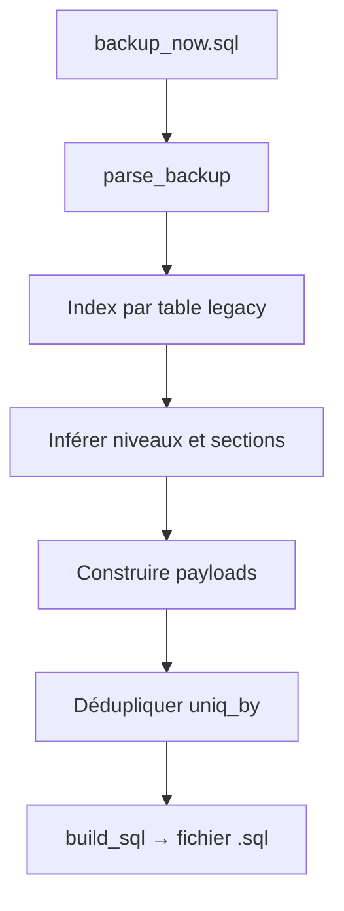

# Algorithme de migration SQL (`generate_migration_sql.py`)

**Script :** `database/generate_migration_sql.py`  
**Entrée :** dump MySQL legacy (`backup_now.sql`)  
**Sortie :** fichier `.sql` exécutable sur la base Laravel cible  

---

## 1. Objectif

Reconstruire la chaîne métier complète à partir de l’ancien système (tables `ap_*`, `hr_*`) :

```
École → Année scolaire (1 active) → Niveaux → Filières → Classes
     → Utilisateurs / Personnel → Cours → Élèves → Inscriptions
```

Sans **école** (`@mig_school_id`), les `school_years`, `students` et `registrations` ne peuvent pas être reliés correctement.

---

## 2. Sources lues dans le backup

| Table legacy | Rôle |
|--------------|------|
| `ap_annee_scolaire` | Années scolaires |
| `ap_niveau` | Niveaux |
| `ap_section` | Filières (sections) |
| `ap_class` | Classes (niveau + section) |
| `ap_cour` | Cours + volumes / notes max |
| `ap_apprenant` | Élèves |
| `ap_etudie` | **Inscriptions** (matricule, classe, section, année) |
| `hr_employee` | Personnel |
| `system_access` | Login / mot de passe (→ `users`) |

---

## 3. Pipeline Python (avant génération SQL)



### 3.1 Inférence des niveaux / sections

Les niveaux et filières viennent de :

1. `ap_niveau` / `ap_section` (déclaratif)
2. `ap_class`, `ap_cour` (classes et cours)
3. **`ap_etudie`** (inscriptions) — indispensable si le backup n’a presque que des inscriptions

Clé de classe normalisée : `"<niveau> - <section>"` (ex. `1ère - Général`).

### 3.2 Utilisateurs

- Seuls les `hr_employee` ayant une entrée **`system_access`** deviennent des `users`.
- Email : `{username}@pgfe.local` (normalisé).
- Mot de passe : bcrypt du mot de passe legacy, sinon `--default-password`.

### 3.3 Inscriptions (`registrations`)

Une ligne `ap_etudie` est migrée **seulement si** :

- `no_matricule` (élève connu)
- `classes` ou `niveau` → nom de niveau
- `section` → filière
- `annee_scolaire` → nom d’année

Sinon la ligne est ignorée (pas d’INSERT registration).

---

## 4. Ordre d’exécution du SQL généré

| Étape | Action | Variable clé |
|-------|--------|----------------|
| **0** | Créer une **école** si `schools` est vide, ou utiliser `--school-id` | `@mig_school_id` |
| **1** | Insérer les **années scolaires** | `school_years` |
| **1b** | **Désactiver** toutes les années, **activer une seule** (celle marquée active dans le backup, sinon la dernière) | `is_active = 1` |
| **2** | Niveaux académiques | `academic_levels` |
| **3** | Filières | `filiaires` |
| **4** | Comptes `users` | liés à `@mig_school_id` |
| **5** | Fiches `academic_personals` | |
| **6** | `classrooms` | |
| **7** | `courses` | |
| **8** | Liens enseignant ↔ cours | |
| **9** | `students` | matricule unique |
| **10** | `registrations` | DELETE doublon puis INSERT (élève + année + classe requis) |

**TRUNCATE** (destructif) sur : `registrations`, `students`, `courses`, `classrooms`, `users`, `filiaires`, `academic_levels`, `school_years`, etc.  
Les tables **`schools`**, `countries`, `types`, … ne sont **pas** vidées.

---

## 5. Cas « BDD avec seulement users + registrations »

Si la base **cible** ne contient que `users` / `registrations` sans école :

1. Préparer un `backup_now.sql` qui contient au minimum **`ap_etudie`** et **`ap_apprenant`** (sinon pas d’élèves ni d’inscriptions à reconstruire).
2. Lancer le script **sans** `--school-id` pour créer l’école automatiquement :

```bash
python3 database/generate_migration_sql.py \
  --backup /chemin/backup_now.sql \
  --output /chemin/import_migration.sql
```

3. Exécuter le SQL sur la base (après `countries` + `types` seedés).

Le SQL généré :

- insère une école si `schools` est vide ;
- recrée toute la chaîne jusqu’aux `registrations` ;
- active **une seule** année scolaire.

---

## 6. Commandes utiles

```bash
# École auto si table vide
python3 database/generate_migration_sql.py \
  --backup database/backup_now.sql \
  --output database/import_migration.sql

# Forcer un school_id existant
python3 database/generate_migration_sql.py \
  --backup database/backup_now.sql \
  --output database/import_migration.sql \
  --school-id 1

# Personnaliser l’école créée
python3 database/generate_migration_sql.py \
  --backup database/backup_now.sql \
  --output database/import_migration.sql \
  --school-name "École démo ENABEL" \
  --school-city "Goma" \
  --school-address "Avenue migration"
```

**Prérequis cible :** au moins une ligne dans `countries` et `types` (seeders Laravel).

---

## 7. API école (hors script — application Laravel)

Création / mise à jour via API (front) :

| Action | Méthode | URL |
|--------|---------|-----|
| Créer | `POST` | `/api/v1/school/schools` |
| Modifier | `PUT` | `/api/v1/school/schools/{id}` |

Corps JSON minimal (avec organisation) :

```json
{
  "name": "École exemple",
  "city": "Kinshasa",
  "address": "…",
  "country_id": 1,
  "province_id": 1,
  "type_id": 1,
  "sous_division_id": 1
}
```

Voir `docs/frontend-guide-organisation-proved-sous-division.md`.

---

## 8. Résumé

| Problème | Comportement du script |
|----------|-------------------------|
| Pas d’école en base | Étape **0** : INSERT école par défaut |
| Pas d’année dans le backup | Année courante `YYYY-(Y+1)` créée |
| Plusieurs années actives legacy | Étape **1b** : une seule `is_active = 1` |
| Inscriptions sans classe / année | Lignes `ap_etudie` ignorées en Python |
| `--school-id` invalide | Fallback sur la première école existante après INSERT si vide |
